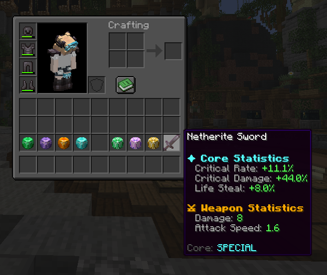
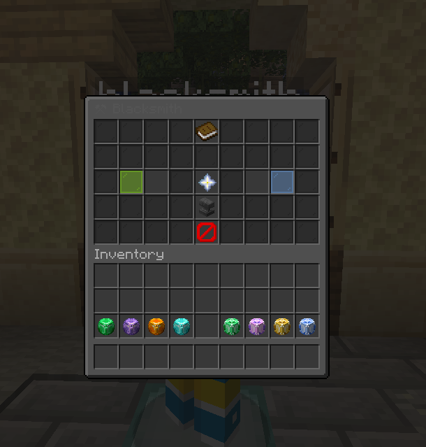

# SkyCore

SkyCore هو بلوقن مخصص لماينكرافت يضيف نظام **Weapon Cores** و **Armor Cores** بإحصائيات عشوائية، مع نظام **Blacksmith** لاستبدال الـCore الموجود على الأسلحة والدروع.

تم تصميم البلوقن ليكون مناسبًا لسيرفرات **RPG** و**Skyblock** و**Survival** التي تعتمد على التقدم، الندرات، تطوير المعدات، الـBosses والـRewards.

---

## المميزات الرئيسية

- Weapon Cores للأسلحة
- Armor Cores للدروع
- إحصائيات عشوائية لكل Core
- أربع درجات Rarity
- Custom Player Head Textures
- Weapon Attributes حقيقية
- Critical Hit System
- Life Steal
- Defense
- Fire Resistance
- Poison Resistance
- Max Health
- نظام Blacksmith كامل
- دعم Vault Economy
- GUI قابل للتعديل
- Sounds قابلة للتعديل
- Messages قابلة للتعديل
- أسعار مختلفة حسب Rarity
- دعم Console Commands
- إعطاء أكثر من Core بأمر واحد
- مناسب للربط مع MythicMobs
- Configurable Stats
- Configurable Textures

---

## Weapon Cores

Weapon Core مخصص لتطوير الأسلحة.

يمكن تركيبه على:

- Swords
- Axes

كل Weapon Core يحصل على مجموعة إحصائيات عشوائية حسب الـRarity الخاصة به.

### Weapon Stats

| Stat | الوظيفة |
|---|---|
| Attack Damage | زيادة الضرر الأساسي للسلاح |
| Attack Speed | زيادة سرعة الهجوم |
| Critical Rate | نسبة حدوث Critical Hit |
| Critical Damage | زيادة قوة الضربة الحرجة |
| Life Steal | استرجاع جزء من الصحة عند ضرب الخصم |

### Weapon Core داخل اللعبة

<p align="center">
  
</p>

---

## Armor Cores

Armor Core مخصص لتطوير قطع الدروع.

يمكن تركيبه على:

- Helmet
- Chestplate
- Leggings
- Boots

كل Armor Core يحصل على Stats عشوائية حسب الـRarity الخاصة به.

### Armor Stats

| Stat | الوظيفة |
|---|---|
| Defense | تقليل الضرر الجسدي |
| Max Health | زيادة الحد الأقصى للصحة |
| Fire Resistance | تقليل ضرر النار واللافا |
| Poison Resistance | تقليل ضرر السم |

> **ملاحظة:**  
> Fire Resistance وPoison Resistance لا يمكن أن يظهرا معًا داخل نفس Armor Core.

### Armor Core داخل اللعبة

<p align="center">
  
</p>

---

## Rarities

SkyCore يحتوي حاليًا على أربع درجات:

| Rarity | المستوى |
|---|---|
| Common | البداية |
| Epic | متوسط |
| Legendary | قوي |
| Special | الأعلى |

كلما ارتفعت الـRarity:

- ترتفع قوة الإحصائيات
- يزيد عدد الإحصائيات الممكنة
- يصبح الـCore أكثر قيمة
- تزداد تكلفة استبداله في Blacksmith

---

## Core Statistics

عند تركيب Core على سلاح أو درع، يتم نقل الإحصائيات إلى القطعة نفسها.

مثال:

```text
✦ Core Statistics
Attack Damage: +6.9
Critical Rate: +7.2%

⚔ Weapon Statistics
Damage: 14.9
Attack Speed: 1.6

Core: LEGENDARY
```

### إحصائيات السلاح بعد تركيب الـCore

<p align="center">
  
</p>

---

## Blacksmith

يتيح نظام **Blacksmith** للاعب تركيب Core على سلاح أو قطعة درع، كما يسمح باستبدال الـCore الحالي بواحد جديد مقابل تكلفة مالية تعتمد على الـRarity.

طريقة الاستخدام:

1. ضع السلاح أو قطعة الدرع في الخانة المخصصة.
2. ضع الـCore المتوافق في خانة الـCore.
3. راجع السعر والمعلومات الظاهرة داخل الـGUI.
4. أكّد العملية لتركيب الـCore الجديد.

عند استبدال Core موجود، تتم إزالة إحصائيات الـCore القديم وتطبيق إحصائيات الـCore الجديد، لمنع تراكم الإحصائيات على القطعة نفسها.

### واجهة الـBlacksmith

<p align="center">
  
</p>

---

## الاقتصاد

يدعم SkyCore نظام **Vault Economy** لحساب تكلفة تركيب واستبدال الـCores. ويمكن تحديد سعر مختلف لكل Rarity من ملفات الإعدادات.

يتطلب استخدام النظام الاقتصادي وجود:

- Vault
- بلوقن Economy متوافق مع Vault

---

## التخصيص

يمكن تعديل الأنظمة الأساسية للبلوقن من ملفات الإعدادات، بما في ذلك:

- نطاقات الـStats لكل Rarity
- أسعار الـBlacksmith
- Player Head Textures الخاصة بالـCores
- أسماء العناصر والـLore
- رسائل البلوقن
- الأصوات
- عناصر وتصميم الـGUI

---

## التوافق

- **Server Software:** Paper 1.21+
- **Java:** Java 21
- **Economy:** Vault
- مناسب للاستخدام مع MythicMobs والـCrates وأنظمة الـBoss Rewards

---

## التثبيت

1. تأكد من تشغيل السيرفر على **Java 21** و**Paper 1.21+**.
2. ثبّت **Vault** وبلوقن Economy متوافقًا معه إذا كنت تريد استخدام نظام الأسعار.
3. ضع ملف `SkyCore.jar` داخل مجلد `plugins`.
4. أعد تشغيل السيرفر.
5. عدّل ملفات الإعدادات التي ينشئها البلوقن بما يناسب نظام سيرفرك.

---

## فكرة الاستخدام

يمكن منح الـCores للاعبين من خلال:

- Boss Drops
- MythicMobs
- Crates
- Quests
- Events
- Daily Rewards
- متجر السيرفر

بهذا يصبح تطوير الأسلحة والدروع جزءًا أساسيًا من تقدم اللاعب، بدل الاعتماد على المعدات العادية فقط.

---

## ملاحظات مهمة

- يجب أن يكون نوع الـCore متوافقًا مع نوع القطعة المستخدمة.
- الـWeapon Cores تعمل على السيوف والفؤوس فقط.
- الـArmor Cores تعمل على قطع الدروع فقط.
- استبدال الـCore لا يكدّس الإحصائيات القديمة مع الجديدة.
- جميع القيم والأسعار والرسائل والأصوات قابلة للتخصيص.

---

## SkyCore

نظام تطوير معدات مصمم لإضافة تقدم أعمق، ندرة حقيقية، وقيمة أكبر للـBosses والـRewards داخل سيرفرك.
