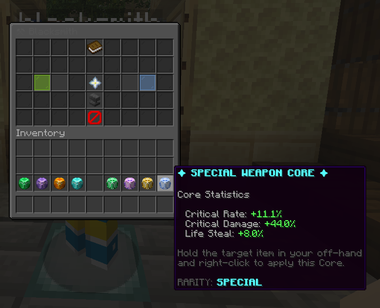
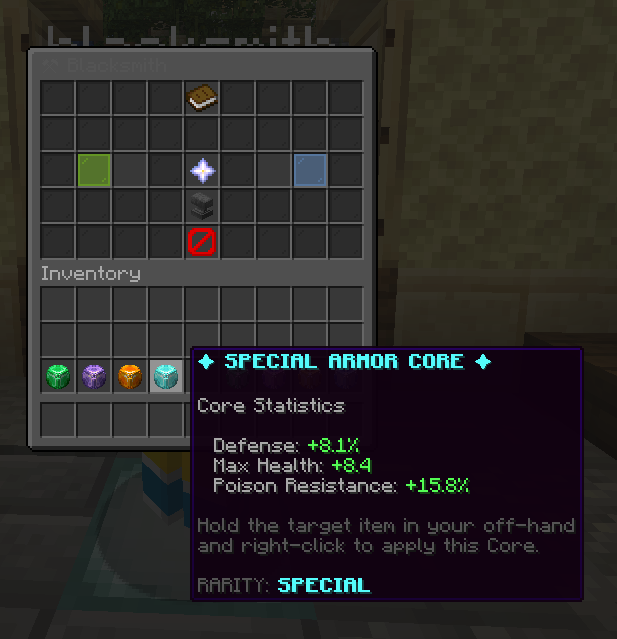

# SkyCore


SkyCore هو بلوقن مخصص لماينكرافت يضيف نظام **Weapon Cores** و **Armor Cores** بإحصائيات عشوائية، مع نظام Blacksmith لاستبدال الـCore الموجود على الأسلحة والدروع.

تم تصميم البلوقن ليكون مناسبًا لسيرفرات الـRPG وSkyblock وSurvival التي تعتمد على التقدم، الندرات، تطوير المعدات، والـBoss Rewards.

---

# المميزات الرئيسية

- Weapon Cores للأسلحة
- Armor Cores للدروع
- إحصائيات عشوائية حسب الندرة
- أربع Rarities مختلفة
- Custom Head Textures
- نظام Blacksmith كامل
- دعم Vault Economy
- GUI قابل للتعديل بالكامل
- دعم Console Commands
- مناسب للربط مع MythicMobs
- Configurable Stats
- Configurable Textures
- Configurable Sounds
- Configurable Messages
- إمكانية إعطاء أكثر من Core بأمر واحد
- كل Core يتم توليده بإحصائيات عشوائية مستقلة
- Weapon Core يعمل فقط على الأسلحة المدعومة
- Armor Core يعمل فقط على قطع الدروع
- إمكانية استبدال الـCore الموجود من خلال Blacksmith

---

# Weapon Cores

يمكن تركيب Weapon Core على:

- Swords
- Axes

كل Core يحصل على مجموعة من الإحصائيات حسب الـRarity الخاصة به.

## Weapon Stats

| Stat | الوظيفة |
|---|---|
| Attack Damage | زيادة الضرر الأساسي للسلاح |
| Attack Speed | زيادة سرعة الهجوم |
| Critical Rate | نسبة حدوث Critical Hit |
| Critical Damage | زيادة ضرر الضربة الحرجة |
| Life Steal | استرجاع جزء من الصحة عند ضرب الخصم |

### Weapon Core



---

# Armor Cores

يمكن تركيب Armor Core على:

- Helmet
- Chestplate
- Leggings
- Boots

## Armor Stats

| Stat | الوظيفة |
|---|---|
| Defense | تقليل الضرر الجسدي |
| Max Health | زيادة الحد الأقصى للصحة |
| Fire Resistance | تقليل ضرر النار واللافا |
| Poison Resistance | تقليل ضرر السم |

> Fire Resistance وPoison Resistance لا يمكن أن يظهرا معًا داخل نفس Armor Core.

### Armor Core



---

# Rarities

SkyCore يحتوي حاليًا على أربع درجات:

| Rarity | المستوى |
|---|---|
| Common | البداية |
| Epic | متوسط |
| Legendary | قوي |
| Special | الأعلى |

كلما ارتفعت الندرة:

- ترتفع قيم الإحصائيات
- يزيد عدد الإحصائيات الممكنة
- يصبح الـCore أقوى
- تصبح فرصة الحصول على Core قوي أكثر قيمة

---

# Core Statistics

عند تركيب Core على السلاح أو الدرع، يتم نقل الإحصائيات إلى القطعة نفسها.

مثال:

```text
✦ Core Statistics
Attack Damage: +6.9
Critical Rate: +7.2%

⚔ Weapon Statistics
Damage: 14.9
Attack Speed: 1.6

Core: LEGENDARY
